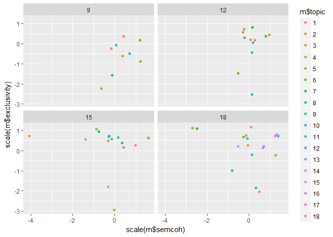
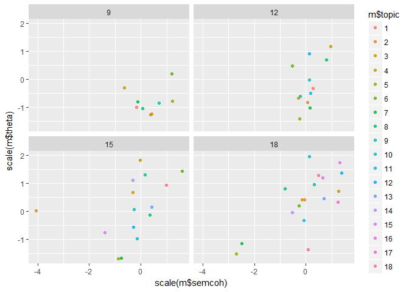
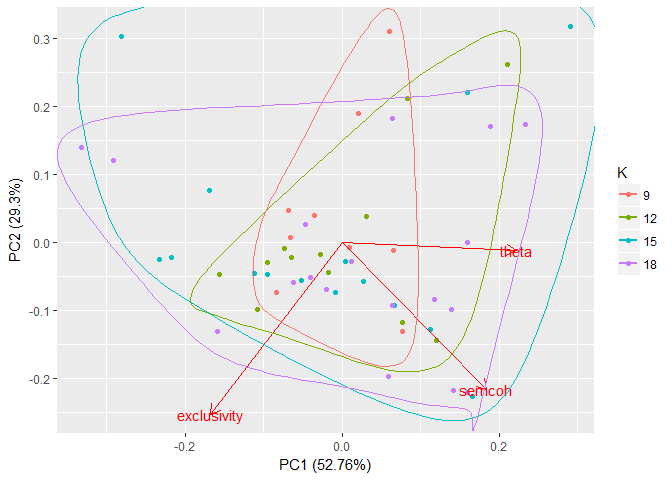

Examples
================
Bindoff, A.
28 February 2018

### Extract statistics from 4 models

`fit` is an object returned by `stm::manyTopics`

``` r
N <- 12  # number of top exemplars to compute theta from
m <- extractFit(fit, documents = docs, n = N)
```

Plots
-----

Semantic coherence x Exclusivity

``` r
ggplot(m, aes(x = scale(m$semcoh), y = scale(m$exclusivity), colour = m$topic)) +
  facet_wrap(~ K) +
  geom_point(alpha = 4/5)
```



Semantic coherence x Theta

``` r
ggplot(m, aes(x = scale(m$semcoh), y = scale(m$theta), colour = m$topic)) +
  facet_wrap(~ K) +
  geom_point(alpha = 4/5)
```



PCA

``` r
pcaPlot.stm(m)
```



All above plots seem to suggest that the 15 and 18 topic models look good but have some low quality topics, leaving the 12 topic model as the parsimonious winner. Alternatively, the 15 topic model could be selected, discarding the two low quality topics it contains.
